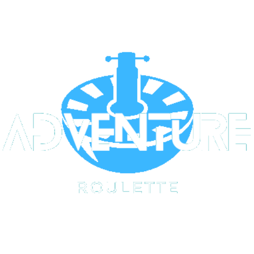

<!-- PROJECT LOGO -->
 

  

  <h3 align="center">Adventure Roulette</h3>

  

    A project created for SwampHacks IX (2023)!
     
    <a href="https://github.com/"><strong>Visit App »</strong></a>
     
     
    <a href="https://www.youtube.com/">View Demo</a>
  

<!-- ABOUT THE PROJECT -->
## About The Project

Enter text here

(<a href="#readme-top">back to top</a>)

